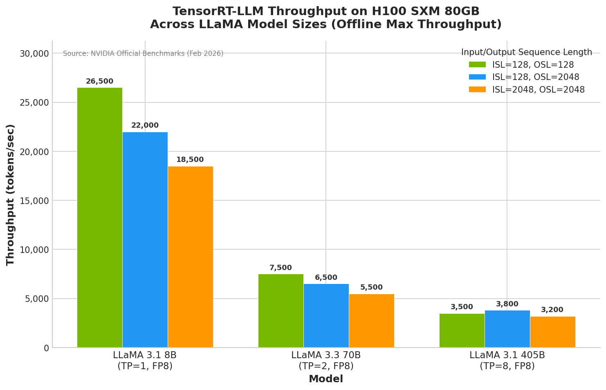
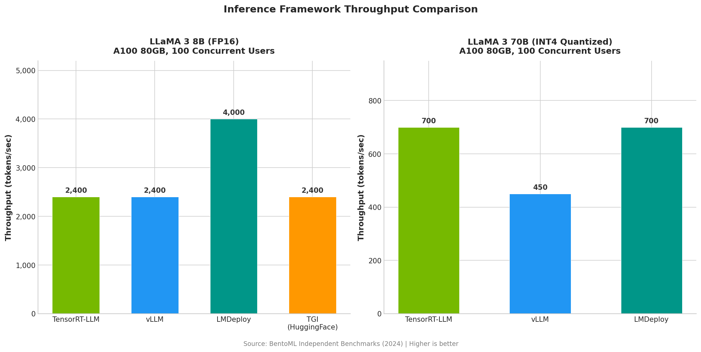
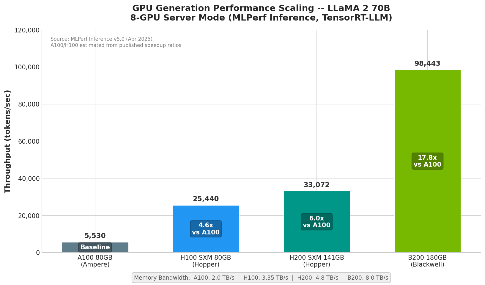

# NVIDIA TensorRT-LLM: Comprehensive Technical Report

**Date:** February 2026
**Version Covered:** TensorRT-LLM v1.3.x
**Sources:** NVIDIA official documentation, MLPerf submissions, BentoML benchmarks, vLLM blog, HuggingFace Optimum-NVIDIA, NVIDIA Developer Blog, TensorRT-LLM GitHub repository

---

## Table of Contents

1. [Executive Summary](#1-executive-summary)
2. [Core Features & Architecture](#2-core-features--architecture)
3. [Supported Models](#3-supported-models)
4. [Benchmark Performance](#4-benchmark-performance)
5. [Key Takeaways](#5-key-takeaways)

---

## 1. Executive Summary

NVIDIA TensorRT-LLM is an open-source, high-performance inference optimization library purpose-built for accelerating Large Language Model (LLM) workloads on NVIDIA GPUs. Built on top of PyTorch and wrapping NVIDIA's TensorRT deep learning compiler, it provides a Python-native API for defining, compiling, and executing LLMs with state-of-the-art throughput and latency characteristics. As of early 2026, the library has reached version 1.3.x and supports over 93 distinct model architectures spanning decoder-only language models, encoder-decoder models, multimodal vision-language models, and speech models such as Whisper.

The framework's core architectural design follows a three-stage pipeline: model definition through a modular PyTorch API, engine compilation via TensorRT's graph-level optimizer (which performs kernel selection, operation fusion, and memory planning), and runtime execution through a dedicated PyExecutor worker that manages request scheduling, KV cache allocation, model inference, and token sampling. This pipeline transforms standard model weights into highly optimized CUDA execution plans tailored to the target GPU architecture.

TensorRT-LLM's feature set addresses every major bottleneck in LLM inference. In-flight batching (continuous batching) eliminates GPU idle time caused by variable-length outputs, delivering more than 2x throughput improvements over static batching on H100 GPUs. Paged KV caching, inspired by operating system virtual memory, eliminates memory fragmentation and enables substantially larger effective batch sizes. Comprehensive quantization support -- including FP8 and FP4 on Hopper and Blackwell GPUs respectively, along with INT8 SmoothQuant, INT4 AWQ, and GPTQ -- delivers 2x to 8x memory reduction while maintaining near-baseline accuracy. Eight speculative decoding methods (Draft-Target, N-Gram, Medusa, EAGLE v1/v2/v3, ReDrafter, Lookahead, and Multi-Token Prediction) reduce per-token latency by up to 3.6x for latency-sensitive applications. Multi-GPU scaling is handled through tensor parallelism, pipeline parallelism, and expert parallelism for Mixture-of-Experts models, enabling deployment from single-GPU setups to multi-node clusters.

The model ecosystem is extensive. TensorRT-LLM supports all major open-weight LLM families, including Meta's Llama series (through Llama 4), Mistral and Mixtral, Alibaba's Qwen (through Qwen3), Google's Gemma, DeepSeek (through V3.2), Microsoft's Phi series, and many others. First-class support for MoE architectures -- with 13+ MoE models supported and features like expert parallelism and FP8/FP4 expert quantization -- reflects the growing importance of sparse models. Multimodal support extends to 13+ architectures on the PyTorch backend alone, covering language-image, language-video, and language-audio modalities.

Benchmark performance is compelling. On MLPerf Inference v5.0, NVIDIA's B200 NVL8 system running TensorRT-LLM achieved 98,443 tokens/second on LLaMA 2 70B in server mode -- a 3.0x improvement over H200. On Blackwell hardware with FP4 quantization, a single B200 GPU runs LLaMA 3.3 70B at over 10,000 tokens/second, and NVIDIA's headline claim places LLaMA 4 throughput at over 40,000 tokens/second. Compared to stock HuggingFace Transformers, TensorRT-LLM delivers up to 28x higher throughput and 3.3x lower time-to-first-token. Against peer frameworks like vLLM and LMDeploy, TensorRT-LLM is broadly competitive, with particular strength in prefill-heavy and high-batch-throughput scenarios. Software-only optimizations on the same hardware have yielded up to 3.8x cumulative improvement over time, demonstrating NVIDIA's sustained engineering investment in the platform.

---

## 2. Core Features & Architecture

### 2.1 High-Level Architecture

TensorRT-LLM's architecture centers on a three-stage pipeline that transforms model definitions into optimized GPU inference engines:

| Stage | Description |
|-------|-------------|
| **Model Definition** | Models are defined using a PyTorch-native, modular Python API. Over 40 pre-defined architectures are available, or users can define custom models using native PyTorch code. |
| **Engine Compilation** | The TensorRT compiler performs graph-level optimizations: kernel selection per operation and GPU, fusion opportunity identification, and compilation into optimized CUDA execution plans. Explicit plugins handle complex fusions (e.g., `gpt_attention` for FlashAttention-like fused attention). |
| **Runtime Execution** | The compiled engine is executed through the runtime system, which manages request scheduling, KV cache allocation, token sampling, and result delivery. |

### 2.2 The LLM Class and Python API

The primary user-facing abstraction is the `LLM` class, providing a simplified interface for end-to-end inference:

```python
from tensorrt_llm import LLM, SamplingParams

llm = LLM(model="meta-llama/Llama-3.1-8B-Instruct")
sampling_params = SamplingParams(temperature=0.7, top_p=0.9)

prompts = ["What is deep learning?", "Explain quantum computing."]
for output in llm.generate(prompts, sampling_params):
    print(f"Prompt: {output.prompt!r}")
    print(f"Generated: {output.outputs[0].text!r}")
```

The API supports synchronous generation, asynchronous generation, and streaming. Multi-GPU inference is configured directly through constructor parameters:

```python
# Tensor parallelism across 4 GPUs
llm = LLM(model="meta-llama/Llama-3.1-70B-Instruct", tensor_parallel_size=4)

# Combined tensor + pipeline parallelism
llm = LLM(model="meta-llama/Llama-3.1-405B-Instruct",
           tensor_parallel_size=4, pipeline_parallel_size=2)
```

Additional capabilities include LoRA adapter support at runtime, multimodal inputs for vision-language models, and speculative decoding for lower latency.

### 2.3 PyExecutor Worker Architecture

Internally, each GPU rank runs a dedicated `PyExecutor(Worker)` process with four primary components:

| Component | Responsibility |
|-----------|---------------|
| **Scheduler** | Determines which active requests proceed at each processing step |
| **KVCacheManager** | Manages allocation and maintenance of the Key-Value cache for autoregressive generation |
| **ModelEngine** | Loads and executes the language model on GPU hardware |
| **Sampler** | Applies sampling strategies (greedy, top-k, top-p, beam search) to convert logits into output tokens |

### 2.4 In-Flight Batching (Continuous Batching)

Traditional static batching wastes GPU cycles because completed sequences remain idle until the longest sequence finishes. TensorRT-LLM implements in-flight batching with three key properties:

- **Immediate Eviction:** Completed sequences are removed from the active batch instantly.
- **Dynamic Insertion:** New requests fill vacated slots at any iteration.
- **Iteration-Level Scheduling:** The scheduler makes decisions at every forward-pass iteration, not at the batch level.

The scheduler also distinguishes between the compute-intensive **context phase** (prefill) and the memory-bandwidth-bound **generation phase** (decode), interleaving them across different requests through chunked context processing. This approach has been shown to at minimum double throughput compared to static batching on H100 GPUs.

### 2.5 Paged KV Caching

TensorRT-LLM implements paged KV caching, inspired by virtual memory paging in operating systems:

- KV cache memory is divided into fixed-size blocks (pages).
- Each request's cache is allocated in non-contiguous blocks as needed.
- Blocks are allocated on demand and freed immediately when sequences complete.
- A block table maps logical token positions to physical memory blocks.

Advanced features include:

| Feature | Description |
|---------|-------------|
| **KV Cache Reuse** | Shared prompt prefixes (e.g., system prompts) share cache blocks across requests |
| **Limited Attention Window** | Sliding-window models automatically free old cache blocks |
| **KV Cache Offloading** | Offloads cache blocks to CPU memory when GPU memory is constrained |

### 2.6 Quantization Support

TensorRT-LLM provides extensive quantization to reduce model memory footprint and accelerate inference:

| Method | Precision | Description |
|--------|-----------|-------------|
| **FP16 / BF16** | 16-bit | Standard half-precision; 2x memory reduction vs FP32 |
| **INT8 Weight-Only** | W8A16 | Weights quantized to INT8; activations remain FP16/BF16 |
| **INT4 Weight-Only** | W4A16 | Weights quantized to INT4; ~4x weight memory reduction |
| **SmoothQuant** | W8A8 (INT8) | Both weights and activations quantized; outlier smoothing |
| **AWQ** | W4A16 | Per-group scaling with activation-aware weight preservation |
| **GPTQ** | W4A16 | Per-group quantization with second-order optimization |
| **FP8 (E4M3)** | W8A8 | Native on Hopper GPUs; near-FP16 accuracy with hardware Transformer Engine |
| **NVFP4** | W4A4 | Blackwell-specific; 8x memory reduction vs FP32 |

**Memory reduction summary:**

| Format | Approximate Reduction vs FP32 |
|--------|-------------------------------|
| FP16/BF16 | 2x |
| INT8 / FP8 | 4x |
| INT4 / FP4 | 8x |

### 2.7 Parallelism Strategies

TensorRT-LLM supports multiple parallelism strategies for scaling across GPUs and nodes:

- **Tensor Parallelism (TP):** Splits weight matrices across GPUs. Requires high-bandwidth NVLink interconnect. Ideal for single-node scaling (2, 4, or 8 GPUs).
- **Pipeline Parallelism (PP):** Assigns different layers to different GPUs. Less communication overhead; suitable for cross-node scaling.
- **Expert Parallelism (EP):** Distributes MoE experts across GPUs. Supports "Wide Expert Parallelism" when GPUs exceed experts.
- **Helix Parallelism:** Advanced strategy for heterogeneous or complex topologies.

### 2.8 Speculative Decoding

Eight speculative decoding methods are supported to reduce per-token latency:

| Method | Approach |
|--------|----------|
| **Draft-Target Model** | Smaller draft model generates candidates; target validates |
| **N-Gram** | Copies tokens from input as drafts (ideal for summarization, code editing) |
| **Medusa** | Multiple LM heads predict future tokens in a tree structure |
| **EAGLE (v1/v2/v3)** | Transformer-based draft prediction from hidden states |
| **ReDrafter** | Recurrent predictor with beam search |
| **Lookahead Decoding** | Parallel lookahead/verification; no additional training needed |
| **MTP (Multi-Token Prediction)** | Multiple jointly trained prediction heads |

### 2.9 Runtime Optimizations

- **CUDA Graphs:** Capture GPU kernel sequences as single executable graphs, delivering up to 22% end-to-end throughput increase by eliminating per-iteration kernel launch overhead.
- **Overlap Scheduler:** Hides CPU scheduling latency behind GPU computation by launching the next iteration's GPU work immediately.
- **Fused Multi-Head Attention (Context FMHA):** Fuses attention operations and avoids materializing the full O(N^2) attention matrix.

### 2.10 Serving and Deployment

TensorRT-LLM includes `trtllm-serve`, a built-in server exposing OpenAI-compatible endpoints:

```bash
trtllm-serve "meta-llama/Llama-3.1-8B-Instruct"
```

For production deployment, TensorRT-LLM integrates with NVIDIA Triton Inference Server through a dedicated C++ backend that chains preprocessing (tokenization), TensorRT-LLM inference, and postprocessing (detokenization) into an orchestrated pipeline. Multi-GPU execution is supported through Leader Mode (one Triton process per GPU) and Orchestrator Mode (MPI-based worker spawning).

| CLI Tool | Purpose |
|----------|---------|
| `trtllm-serve` | Launch an OpenAI-compatible serving endpoint |
| `trtllm-bench` | Benchmark inference performance |
| `trtllm-eval` | Evaluate model quality on standard benchmarks |

---

## 3. Supported Models

TensorRT-LLM supports over 93 distinct model architectures across two backends. The framework operates with a **PyTorch backend** (the newer, actively developed path) and a **TensorRT backend** (legacy/classic, broadest model coverage).

### 3.1 Model Ecosystem at a Glance

| Category | Count |
|----------|-------|
| Total distinct model architectures | ~93+ |
| PyTorch backend language models | ~23 architecture classes |
| PyTorch backend multimodal models | ~13 architecture classes |
| TensorRT backend LLM models | ~48 architectures |
| TensorRT backend multimodal models | ~16 architectures |
| MoE model architectures | 13+ |
| Supported GPU generations | 5 |
| Quantization methods | 10+ |
| Source framework conversion paths | 5 |

### 3.2 Language Models -- PyTorch Backend

| Architecture Class | Model Family | Example |
|--------------------|-------------|---------|
| `LlamaForCausalLM` | Llama 3.1, Llama 3, Llama 2 | meta-llama/Meta-Llama-3.1-70B |
| `DeepseekV3ForCausalLM` | DeepSeek-V3 | deepseek-ai/DeepSeek-V3 |
| `DeepseekV32ForCausalLM` | DeepSeek-V3.2 | deepseek-ai/DeepSeek-V3.2 |
| `MistralForCausalLM` | Mistral | mistralai/Mistral-7B-v0.1 |
| `MixtralForCausalLM` | Mixtral (MoE) | mistralai/Mixtral-8x7B-v0.1 |
| `Qwen2ForCausalLM` | Qwen2, QwQ | Qwen/Qwen2-7B-Instruct |
| `Qwen3ForCausalLM` | Qwen3 | Qwen/Qwen3-8B |
| `Qwen3MoeForCausalLM` | Qwen3 MoE | Qwen/Qwen3-30B-A3B |
| `Qwen3NextForCausalLM` | Qwen3Next | Qwen/Qwen3-Next-80B-A3B-Thinking |
| `Gemma3ForCausalLM` | Gemma 3 | google/gemma-3-1b-it |
| `Phi3ForCausalLM` | Phi-4 | microsoft/Phi-4 |
| `NemotronForCausalLM` | Nemotron-3/4, Minitron | nvidia/Minitron-8B-Base |
| `NemotronHForCausalLM` | Nemotron-3-Nano | nvidia/NVIDIA-Nemotron-3-Nano-30B-A3B-FP8 |
| `NemotronNASForCausalLM` | NemotronNAS (Super) | nvidia/Llama-3_3-Nemotron-Super-49B-v1 |
| `DeciLMForCausalLM` | Nemotron | nvidia/Llama-3_1-Nemotron-51B-Instruct |
| `Exaone4ForCausalLM` | EXAONE 4.0 | LGAI-EXAONE/EXAONE-4.0-32B |
| `ExaoneMoEForCausalLM` | K-EXAONE | LGAI-EXAONE/K-EXAONE-236B-A23B |
| `Glm4MoeForCausalLM` | GLM-4.5/4.6/4.7 | THUDM/GLM-4-100B-A10B |
| `GptOssForCausalLM` | GPT-OSS | openai/gpt-oss-120b |
| `MiniMaxM2ForCausalLM` | MiniMax M2/M2.1 | MiniMaxAI/MiniMax-M2 |
| `BertForSequenceClassification` | BERT-based | textattack/bert-base-uncased-yelp-polarity |
| `Qwen2ForProcessRewardModel` | Qwen2 Process Reward | Qwen/Qwen2.5-Math-PRM-7B |
| `Qwen2ForRewardModel` | Qwen2 Reward Model | Qwen/Qwen2.5-Math-RM-72B |

### 3.3 Multimodal Models -- PyTorch Backend

| Architecture Class | Model Family | Modalities |
|--------------------|-------------|------------|
| `Gemma3ForConditionalGeneration` | Gemma 3 Vision | Language + Image |
| `Llama4ForConditionalGeneration` | Llama 4 | Language + Image |
| `MllamaForConditionalGeneration` | Llama 3.2 Vision | Language + Image |
| `Mistral3ForConditionalGeneration` | Mistral 3 | Language + Image |
| `LlavaNextForConditionalGeneration` | LLaVA-NeXT | Language + Image |
| `LlavaLlamaModel` | VILA | Language + Image + Video |
| `Qwen2VLForConditionalGeneration` | Qwen2-VL | Language + Image + Video |
| `Qwen2_5_VLForConditionalGeneration` | Qwen2.5-VL | Language + Image + Video |
| `Qwen3VLForConditionalGeneration` | Qwen3-VL | Language + Image + Video |
| `Qwen3VLMoeForConditionalGeneration` | Qwen3-VL MoE | Language + Image + Video |
| `Phi4MMForCausalLM` | Phi-4 Multimodal | Language + Image + Audio |
| `NemotronH_Nano_VL_V2` | Nemotron Nano Vision | Language + Image + Video |
| `HCXVisionForCausalLM` | HyperCLOVAX-SEED-Vision | Language + Image |

### 3.4 TensorRT Backend -- Language Models (Selected)

The TensorRT (classic) backend provides the broadest legacy model coverage with 48+ architectures:

| Category | Models |
|----------|--------|
| **Meta** | LLaMA 1/2/3, Code LLaMA |
| **Mistral AI** | Mistral, Mixtral (8x7B, 8x22B), Mistral NeMo |
| **Alibaba** | Qwen, Qwen1.5 |
| **Google** | Gemma, Gemma2, RecurrentGemma |
| **Microsoft** | Phi-1.5, Phi-2, Phi-3 |
| **BigCode** | StarCoder, SantaCoder |
| **TII** | Falcon (7B/40B/180B) |
| **EleutherAI** | GPT-J, GPT-NeoX |
| **BigScience** | BLOOM (560M to 176B) |
| **Meta** | OPT (125M to 175B) |
| **Encoder-Decoder** | T5, Flan-T5, BART, mBART, mT5, ByT5 |
| **Speech** | Whisper (Tiny to Large-v3) |
| **MoE** | Arctic, DBRX, Grok-1 (314B) |
| **Other** | GPT-2, MPT, Baichuan/Baichuan2, ChatGLM/2/3, GLM-4, InternLM/InternLM2, Mamba 1/2, Granite-3.0, Skywork, Smaug, Replit Code, FairSeq NMT, BERT, RoBERTa |

### 3.5 TensorRT Backend -- Multimodal Models

| Model | Description |
|-------|-------------|
| BLIP2 (OPT/T5) | Vision-language with OPT or T5 backbone |
| CogVLM | THU CogVLM |
| LLaVA (v1.5, NeXT, OneVision) | LLaVA family |
| VILA | NVIDIA VILA |
| NeVA / Video NeVA | NVIDIA NeVA family |
| Fuyu | Adept Fuyu multimodal |
| Kosmos-2 | Microsoft Kosmos-2 |
| Nougat | Meta document understanding |
| Deplot | Chart/plot understanding |
| Phi-3-vision | Microsoft Phi-3 with vision |
| MLLaMA / Llama 3.2 VLM | Meta multimodal LLaMA |

### 3.6 Mixture-of-Experts (MoE) Models

| Model | Architecture | Expert Configuration |
|-------|-------------|---------------------|
| Mixtral 8x7B | Sparse MoE | 8 experts, top-2 routing |
| Mixtral 8x22B | Sparse MoE | 8 experts, top-2 routing |
| DeepSeek-V3 | MoE + MLA | 256 experts, shared experts |
| Arctic | Dense + MoE hybrid | 128 experts |
| DBRX | Fine-grained MoE | 16 experts, top-4 routing |
| Grok-1 | Sparse MoE | 8 experts |
| Qwen3MoE | Sparse MoE | Various configs (e.g., 30B-A3B) |
| GLM-4 MoE | Sparse MoE | GLM-4-100B-A10B |
| K-EXAONE | Sparse MoE | 236B-A23B |
| MiniMax M2 | MoE | Large-scale |

### 3.7 Model Sizes and Parallelism Requirements

| Model Family | Supported Sizes | Typical Parallelism |
|-------------|-----------------|-------------------|
| LLaMA / Llama 2/3 | 7B, 8B, 13B, 70B, 405B | TP=1 (8B), TP=2 (70B), TP=8 (405B) |
| Falcon | 7B, 40B, 180B | TP=1 to TP=8 |
| BLOOM | 560M to 176B | Scales with model size |
| OPT | 125M to 175B | Scales with model size |
| Mixtral | 8x7B, 8x22B | TP + EP |
| DeepSeek-V3 | 671B (37B active) | TP + EP |
| Qwen | 0.5B to 110B+ | Scales with model size |
| Phi | 1.5B to 14B | TP=1 to TP=2 |

### 3.8 HuggingFace Integration

TensorRT-LLM provides seamless HuggingFace Hub integration:

- **Direct loading** from HuggingFace Hub with automatic download
- **Pre-quantized NVIDIA checkpoints** available in FP4 and FP8 formats
- **Five source framework conversion paths:** HuggingFace, NeMo, DeepSpeed, JAX, ModelOpt
- **`trust_remote_code` support** for custom HuggingFace architectures

---

## 4. Benchmark Performance

### 4.1 Throughput Benchmarks on H100

The following results represent offline maximum throughput with FP8 quantization on H100 SXM 80GB:



**Figure 1:** TensorRT-LLM throughput (tokens/sec) across LLaMA 3.1 8B, 3.3 70B, and 3.1 405B on H100 at multiple input/output sequence length configurations.

| Model | ISL/OSL=128/128 | ISL/OSL=128/2048 | ISL/OSL=2048/2048 | ISL/OSL=20000/2000 | TP |
|-------|-----------------|-------------------|--------------------|--------------------|-----|
| LLaMA 3.1 8B | ~26,500 | ~22,000 | ~18,500 | ~1,500 | 1 |
| LLaMA 3.3 70B | ~7,500 | ~6,500 | ~5,500 | ~800 | 2 |
| LLaMA 3.1 405B | ~3,500 | ~3,800 | ~3,200 | N/A | 8 |

Peak recorded throughput: **28,390 tokens/sec** (LLaMA 3.1 8B, ISL=128/OSL=128, trtllm-bench).

### 4.2 Throughput on H200 and Blackwell

**H200 SXM 141GB (FP8):**

| Model | ISL/OSL=128/128 | ISL/OSL=128/2048 | TP |
|-------|-----------------|-------------------|----|
| LLaMA 3.1 8B | 27,305 | 24,046 | 1 |
| LLaMA 3.3 70B | ~9,000 | ~8,500 | 2 |
| LLaMA 3.1 405B | ~5,000 | ~5,200 | 8 |

**B200 Blackwell (FP4):**

| Model | ISL/OSL=128/128 | ISL/OSL=128/2048 | TP |
|-------|-----------------|-------------------|----|
| LLaMA 3.3 70B | 10,614 | 9,446 | **1 (single GPU)** |
| LLaMA 3.1 405B | 6,219 | 7,178 | 4 |
| LLaMA 4 (headline) | >40,000 | -- | 8 |

A standout result: FP4 quantization on Blackwell enables **single-GPU inference of LLaMA 3.3 70B** at over 10,000 tokens/second, fundamentally changing deployment economics for 70B-class models.

### 4.3 Framework Comparison



**Figure 2:** TensorRT-LLM vs vLLM vs LMDeploy vs TGI throughput comparison on LLaMA 3 8B (FP16) and LLaMA 3 70B (INT4) at 100 concurrent users on A100 80GB.

**LLaMA 3 8B (FP16), 100 concurrent users, A100 80GB:**

| Framework | Throughput (tok/s) |
|-----------|--------------------|
| LMDeploy | ~4,000 |
| TensorRT-LLM | ~2,400 |
| vLLM | ~2,400 |
| TGI (HuggingFace) | ~2,400 |

**LLaMA 3 70B (INT4 Quantized), 100 concurrent users, A100 80GB:**

| Framework | Throughput (tok/s) |
|-----------|--------------------|
| TensorRT-LLM | ~700 |
| LMDeploy | ~700 |
| vLLM | ~450 |

**TensorRT-LLM vs HuggingFace Transformers (H100, LLaMA 2):**

| Metric | Improvement |
|--------|-------------|
| Throughput | Up to **28x** faster |
| First token latency | Up to **3.3x** faster |
| Peak throughput (LLaMA 2 7B/13B FP8) | 1,200 tokens/sec |

**TensorRT-LLM vs vLLM (Summary):** The two frameworks are broadly competitive in 2024-2025. TensorRT-LLM generally leads on prefill-heavy and high-batch-throughput workloads, while vLLM is competitive or marginally ahead on decode-heavy, conversational (ShareGPT-style) workloads. Time-to-first-token and time-per-output-token are comparable across most scenarios.

### 4.4 MLPerf Inference Results

MLPerf is the industry-standard benchmark suite run by MLCommons. NVIDIA consistently uses TensorRT-LLM as its inference backend.



**Figure 3:** GPU generation performance scaling from A100 through B200 on LLaMA 2 70B using MLPerf data.

**MLPerf Inference v5.0 (April 2025) -- LLaMA 2 70B:**

| GPU System | Server (tok/s) | Offline (tok/s) | vs H200 |
|------------|----------------|-----------------|---------|
| H200 8-GPU | 33,072 | 34,988 | Baseline |
| B200 NVL8 | **98,443** | **98,858** | **3.0x (server), 2.8x (offline)** |

**MLPerf Inference v5.0 -- Mixtral 8x7B:**

| GPU System | Server (tok/s) | Offline (tok/s) | vs H200 |
|------------|----------------|-----------------|---------|
| H200 | 61,802 | 62,630 | Baseline |
| B200 | **126,845** | **128,148** | **2.1x** |

**MLPerf Inference v5.0 -- LLaMA 3.1 405B:**
- GB200 NVL72 delivered up to **3.4x higher per-GPU performance** vs H200 8-GPU
- At system level: up to **30x throughput increase** (3.4x per-GPU x 9x more GPUs)

### 4.5 GPU Generation Performance Scaling

| GPU | Architecture | Memory | Bandwidth | LLaMA 2 70B Relative Perf |
|-----|-------------|--------|-----------|---------------------------|
| A100 80GB | Ampere | 80GB HBM2e | 2.0 TB/s | 1.0x (baseline) |
| H100 SXM 80GB | Hopper | 80GB HBM3 | 3.35 TB/s | 4.0-4.6x |
| GH200 96GB | Grace Hopper | 96GB HBM3 | 4.0 TB/s | ~5.6x |
| H200 SXM 141GB | Hopper | 141GB HBM3e | 4.8 TB/s | ~6.0x |
| B200 180GB | Blackwell | 180GB HBM3e | 8.0 TB/s | ~17.8x |

### 4.6 Total Cost of Ownership (TCO) Impact

| Model | TCO Reduction (H100+TRT-LLM vs A100+PyTorch) | Energy Reduction |
|-------|-----------------------------------------------|------------------|
| GPT-J 6B | **5.3x** | **5.6x** |
| LLaMA 2 70B | **3.0x** | **3.2x** |

### 4.7 Software-Only Optimization Gains

A defining characteristic of TensorRT-LLM is its sustained software improvement cadence on the same hardware:

| Benchmark | Improvement | Timeframe |
|-----------|-------------|-----------|
| GPT-J on Hopper (offline) | 2.9x | Since initial Hopper support |
| GPT-J on Hopper (server) | 3.8x | Since initial Hopper support |
| LLaMA 2 70B on H100 | 1.5x | One year of software updates |
| MLPerf v4.0 to v4.1 | 14% | XQA kernel + layer fusion optimizations |

### 4.8 Published Speedup Claims Summary

| Claim | Context |
|-------|---------|
| Up to **8x** faster | GPT-J 6B: H100+TRT-LLM vs A100+PyTorch |
| Up to **28x** faster | LLaMA 2 on H100 vs stock HuggingFace Transformers |
| Up to **4.6x** faster | LLaMA 2 70B: H100 vs A100 |
| Up to **4x** per-GPU | B200 vs H100 on LLaMA 2 70B (MLPerf v4.1) |
| Up to **3.4x** per-GPU | GB200 NVL72 vs H200 on LLaMA 3.1 405B |
| **>40,000** tok/s | LLaMA 4 on B200 GPUs |
| Up to **3.6x** | Speculative decoding throughput improvement |
| **>2x** throughput | In-flight batching vs static batching |
| Up to **22%** | CUDA Graphs end-to-end throughput increase |

### 4.9 Benchmark Methodology Notes

Important caveats for interpreting these results:

1. NVIDIA's own benchmarks use "offline maximum throughput" scenarios. These represent peak batch throughput, not interactive serving latency.
2. The "up to 28x" claim combines multiple optimizations against an unoptimized HuggingFace Transformers baseline.
3. MLPerf results represent highly tuned submissions; production deployments typically achieve lower throughput.
4. Third-party benchmarks show TensorRT-LLM's TTFT can degrade at very high concurrency (100 concurrent users).
5. Quantization accuracy trade-offs (especially INT4) are not fully captured by throughput benchmarks alone.

---

## 5. Key Takeaways

1. **Performance leadership on NVIDIA hardware.** TensorRT-LLM consistently delivers the highest or near-highest throughput on NVIDIA GPUs across major benchmarks, including MLPerf. The combination of TensorRT compiler optimizations, in-flight batching, paged KV caching, and hardware-specific quantization (FP8/FP4) produces a compounding performance advantage that grows with newer GPU generations.

2. **Blackwell changes the economics.** FP4 quantization on Blackwell GPUs enables single-GPU inference for 70B-class models at over 10,000 tokens/second and reduces the GPU count for 405B models from 8 to 4. This represents a step-function improvement in cost-per-token for large model deployment.

3. **Breadth of model support is unmatched.** With 93+ architectures across language, multimodal, encoder-decoder, and speech models -- and "Day-0" support for major releases like Llama 4 and DeepSeek-R1 -- TensorRT-LLM covers virtually the entire open-weight model ecosystem.

4. **MoE is a first-class citizen.** The framework supports 13+ MoE architectures with dedicated expert parallelism, FP8/FP4 expert quantization, and optimized routing kernels. As MoE models become more prevalent (DeepSeek-V3, Qwen3 MoE, Mixtral), this support is increasingly strategic.

5. **Software gains compound over time.** On the same Hopper hardware, TensorRT-LLM has delivered up to 3.8x throughput improvement through software optimizations alone. This ongoing investment means existing hardware deployments continue to improve with each release.

6. **The competitive gap is narrowing.** While TensorRT-LLM leads on maximum throughput, frameworks like vLLM and LMDeploy are competitive on many workloads, particularly decode-heavy conversational scenarios. The choice of framework increasingly depends on workload characteristics, deployment complexity, and hardware lock-in considerations rather than raw performance alone.

7. **Production-ready ecosystem.** Integration with NVIDIA Triton Inference Server, OpenAI-compatible serving via `trtllm-serve`, comprehensive CLI tooling (`trtllm-bench`, `trtllm-eval`), and seamless HuggingFace Hub interoperability make TensorRT-LLM a viable end-to-end solution from experimentation to production deployment.

8. **Two-backend strategy requires awareness.** The PyTorch backend is the modern, actively developed path; the TensorRT backend provides legacy coverage. Organizations should plan for the PyTorch backend as the long-term direction while leveraging the TensorRT backend for models not yet ported.

---

*Report compiled February 2026. All data sourced from NVIDIA TensorRT-LLM official documentation, GitHub repository, NVIDIA Developer Blog, MLPerf submissions (MLCommons), BentoML benchmarks, vLLM blog, and HuggingFace Optimum-NVIDIA.*
