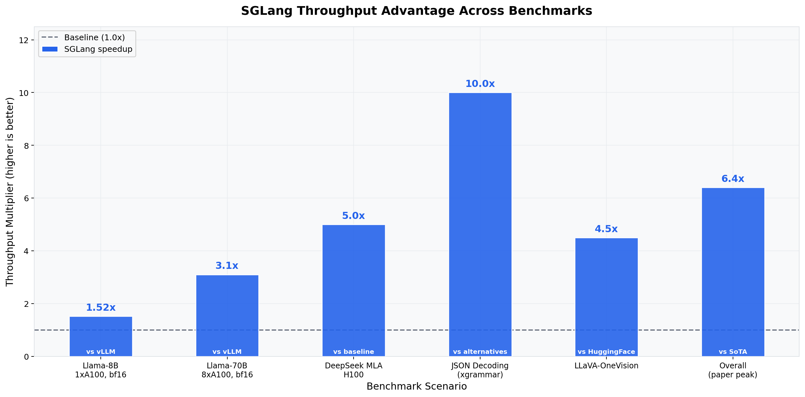
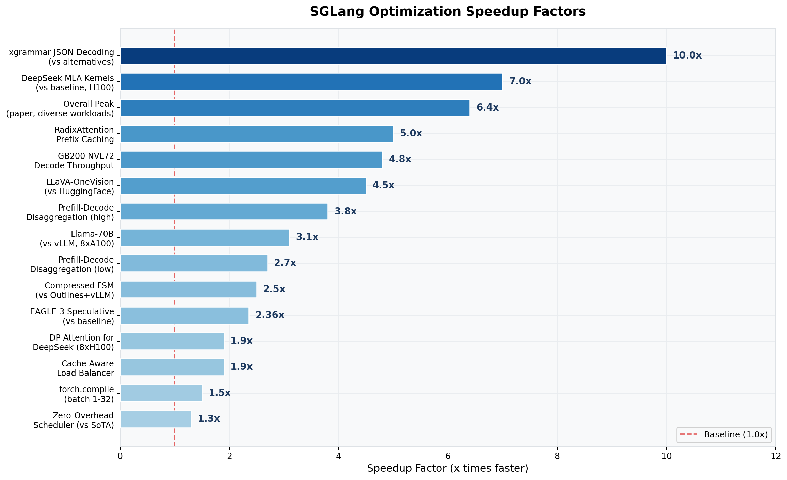
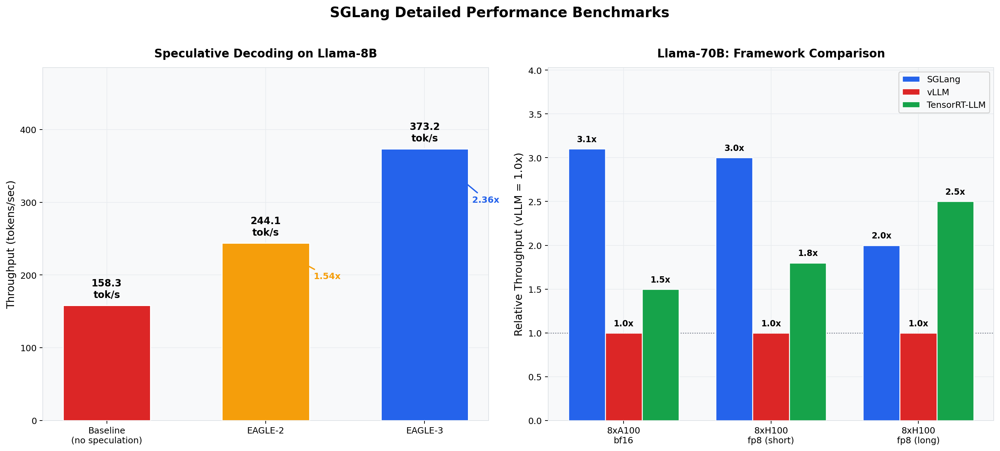

# SGLang: A Research Summary on LLM Inference Framework

**Date:** February 22, 2026 | **Prepared from:** LMSYS research publications and official documentation

---

## 1. Introduction

**SGLang** (Structured Generation Language) is a high-performance open-source serving framework for large language models (LLMs) and multimodal models, developed at **UC Berkeley** under the **LMSYS** organization. First described by Zheng et al. (arXiv:2312.07104, 2023), it provides low-latency, high-throughput inference from single GPUs to distributed clusters. As of early 2026, SGLang powers **400,000+ GPUs globally** for organizations including xAI, NVIDIA, AMD, LinkedIn, Cursor, and all major cloud providers. The project has 23,600 GitHub stars, 1,182 contributors, and is at version **v0.5.8** (Apache-2.0 license).

## 2. Architecture Highlights

- **RadixAttention** -- Organizes KV cache in a radix tree for automatic prefix reuse across requests. Delivers up to **5x throughput gain** with zero overhead on cache misses. Accelerates few-shot learning, multi-turn chat, self-consistency sampling, and tree-of-thought search.

- **Compressed Finite State Machine** -- Jump-forward decoding skips deterministic token sequences during constrained generation, making structured output **faster than unconstrained decoding**. With the xgrammar backend (v0.4+), achieves up to **10x faster JSON decoding**.

- **Zero-Overhead Scheduler** -- Overlaps CPU batch scheduling with GPU execution via CUDA event synchronization. A 4K-line Python scheduler that matches or beats C++ alternatives, yielding **1.3x throughput** over competing solutions.

- **Three-Process Architecture** -- TokenizerManager, Scheduler, and DetokenizerManager communicate via ZMQ IPC for continuous batching with chunked prefill and priority-based request management.

## 3. Performance Features

| Category | Details |
|----------|---------|
| **Parallelism** | Tensor (TP), Pipeline (PP), Expert (EP up to 96 GPUs), Data (DP), Context (CP) |
| **Model Support** | 166 configs: Llama, Qwen, DeepSeek, Gemma, Mistral, Mixtral, vision-language, diffusion, embedding |
| **Quantization** | FP4, FP8, INT4, AWQ, GPTQ, BitsAndBytes, GGUF formats |
| **Hardware** | NVIDIA (GB200/B300/H100/A100), AMD (MI355/MI300), Intel Xeon, Google TPU, Huawei Ascend |
| **Speculative Decoding** | EAGLE-2/3, MTP, Ngram -- EAGLE-3 reaches 373 tok/s (2.36x) on Llama-8B |
| **Other** | Prefill-decode disaggregation (2.7-3.8x), multi-LoRA batching, cache-aware load balancing (1.9x) |

## 4. Benchmark Highlights

SGLang demonstrates **up to 6.4x throughput** over state-of-the-art systems across diverse workloads (Llama, DeepSeek, LLaVA, structured output). Key results:

- **3.1x** over vLLM on Llama-70B (8xA100)
- **3-7x** on DeepSeek MLA (H100)
- **10x** faster JSON decoding (xgrammar)
- **4.5x** on LLaVA-OneVision vs HuggingFace
- **4.8x decode throughput** on GB200 NVL72
- On Qwen3-235B (AMD MI300X), TTFT improved 1.67x (756ms to 451ms) and TPOT improved 2.12x (26ms to 12ms)

SGLang matches or exceeds TensorRT-LLM on most configurations despite being implemented in Python.

*Figure 1: Throughput advantage across benchmarks ranging from 1.52x to 10x over respective baselines.*

*Figure 2: Optimization speedup factors ranked by magnitude, from 1.3x (zero-overhead scheduler) to 10x (xgrammar JSON decoding).*

*Figure 3: Speculative decoding throughput on Llama-8B (left) and three-way framework comparison for Llama-70B (right).*

## 5. Conclusion

SGLang has established itself as a leading open-source LLM inference framework through its co-designed runtime and frontend language. Its RadixAttention KV cache reuse and compressed FSM constrained decoding represent genuine architectural innovations rather than incremental improvements. With broad hardware support (NVIDIA, AMD, Intel, TPU, Ascend), 166 model configurations, and adoption by major cloud providers and AI companies, SGLang is well-positioned as the go-to framework for production LLM serving. Its Python-native scheduler matching C++ alternatives in performance, combined with rapid community growth (1,182 contributors), suggest sustained momentum in the evolving LLM infrastructure ecosystem.

---

**Sources:** Zheng et al., arXiv:2312.07104 (2023) | github.com/sgl-project/sglang | docs.sglang.io | lmsys.org/blog
