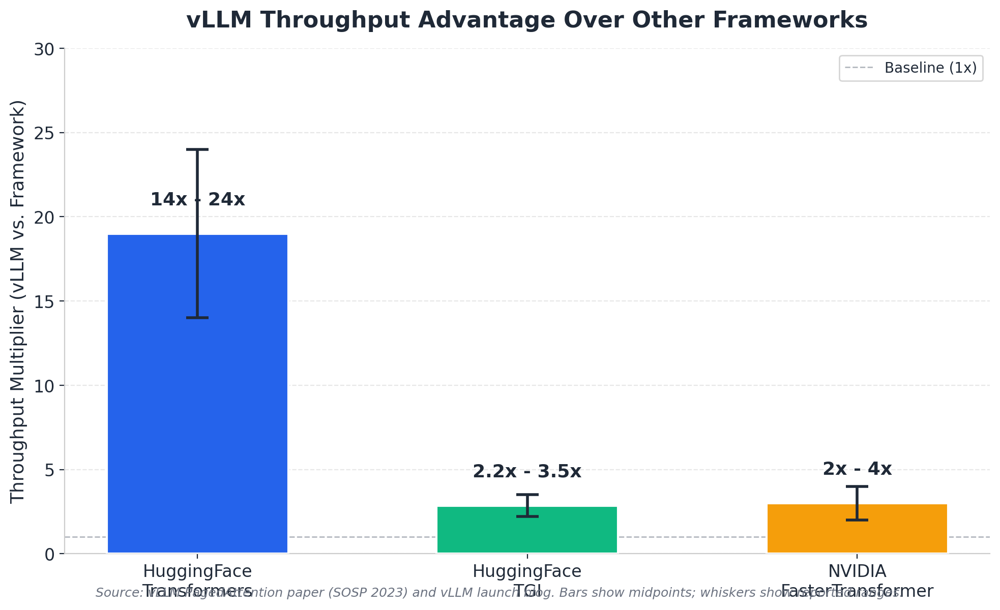
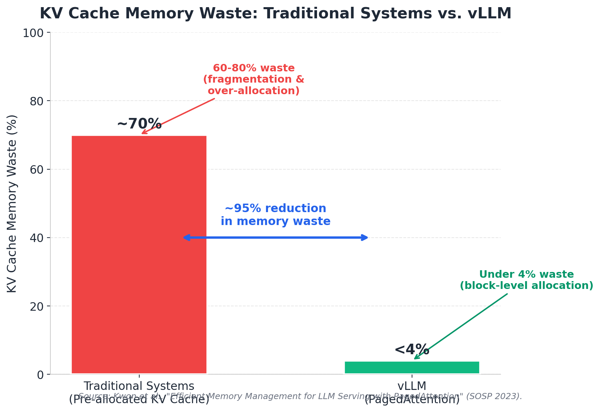
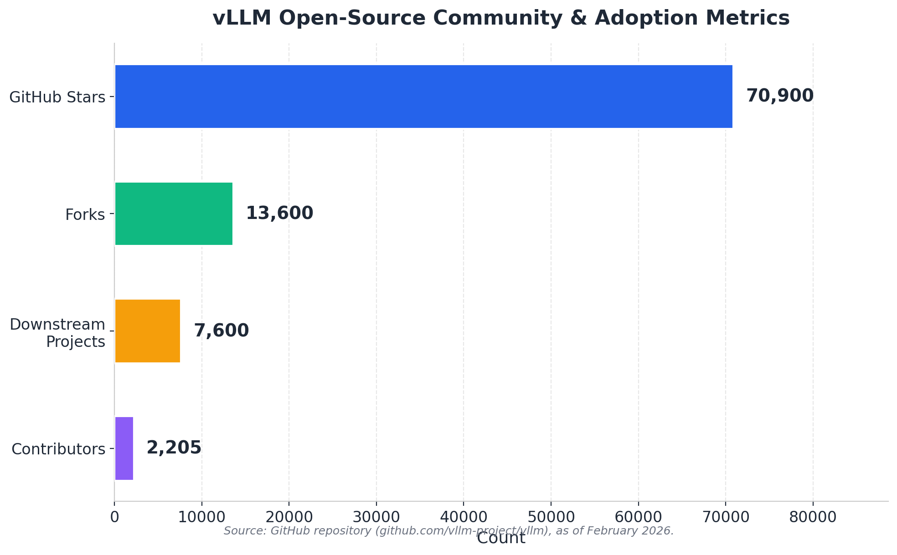

# vLLM: High-Throughput LLM Serving Engine -- Research Summary

**Date:** February 2026 | **Version surveyed:** v0.15.1 | **License:** Apache 2.0

---

## Overview

vLLM is a high-throughput, memory-efficient inference and serving engine for large language models, created at UC Berkeley by Woosuk Kwon et al. and first published at SOSP 2023. Its core algorithm, PagedAttention, redefined KV cache management and propelled vLLM to become the most widely adopted open-source LLM serving framework, with ~70,900 GitHub stars and 7,600+ downstream projects as of February 2026.

## Core Innovation: PagedAttention

Traditional LLM serving systems pre-allocate contiguous GPU memory for the KV cache, wasting 60--80% of that memory through fragmentation and over-reservation. PagedAttention, inspired by OS virtual memory paging, partitions the KV cache into fixed-size blocks mapped through block tables, allocating physical GPU memory on demand. This reduces KV cache waste to under 4%, enables copy-on-write sharing across parallel sequences (cutting memory usage by up to 55%), and directly translates freed memory into larger batch sizes and higher throughput.

## Key Features

- **Continuous batching** -- dynamically adds/removes requests every iteration (up to 23x over static batching)
- **OpenAI-compatible API** -- drop-in replacement with chat, completion, embedding, and streaming endpoints
- **Distributed inference** -- tensor, pipeline, data, and expert parallelism across multi-GPU/multi-node setups
- **Speculative decoding** -- draft-model and n-gram strategies for up to 2.8x latency reduction
- **Automatic prefix caching** -- reuses KV blocks for shared prompts with near-zero overhead
- **Broad quantization** -- GPTQ, AWQ, FP8, INT8, INT4, GGUF, and more (12+ methods)
- **Multi-modal support** -- vision, audio, and video-language models (LLaVA, Qwen-VL, etc.)
- **LoRA hot-swapping** -- serve multiple adapters on one base model without restarts

## Performance

vLLM delivers 14--24x throughput over HuggingFace Transformers and 2.2--3.5x over Text Generation Inference on standard benchmarks. The v0.6.0 release achieved 2.7x throughput and 5x faster time-per-output-token versus v0.5.3 on Llama 3 8B (H100), while the V1 architecture added another 1.7x on top. In production at LMSYS Chatbot Arena, vLLM handles 30k--60k daily requests and cut GPU requirements by 50%.

## Charts

## Adoption & Ecosystem

vLLM has 2,205+ contributors, 13,600 forks, and backing from a16z and Sequoia Capital, with compute sponsorship from AWS, Google Cloud, and NVIDIA. It powers LMSYS Chatbot Arena, integrates with LangChain, LlamaIndex, Ray Serve, and Docker Model Runner, and supports 10+ hardware backends including NVIDIA, AMD, Intel, Google TPU, and AWS Neuron.

## Conclusion

By solving the KV cache memory bottleneck with PagedAttention and pairing it with continuous batching, broad hardware support, and a production-grade API, vLLM has established itself as the de facto open-source standard for high-throughput LLM inference -- making efficient, large-scale model serving accessible to the entire community.
